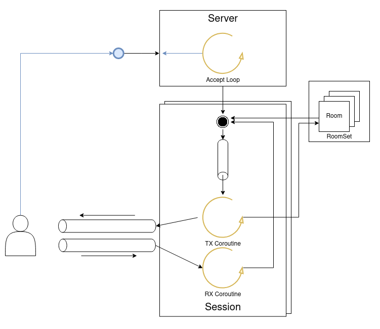

# Simple concurrent TCP/IP room chat server
### Implemented in Kotlin
## Implementation



Using kotlin coroutines, this is an implementation of a group chat server, 
that accepts commands and takes use of the server's threads with use of
suspending coroutines. 

The server works by creating a server, that itself has one coroutine to accept
new connections, which are then placed into sessions.
After the server has the begun, it will begin a command phase, ready to accept
commands from server administrator via console input (See Server Commands).  
A session is composed of two coroutines, the Rx Coroutine and Tx Coroutine,
while the Rx Coroutine is only responsible of reading data sent by the session client
the Tx Coroutine is responsible of receiving Commands from it's suspending queue,
stopping the session, joining and leaving rooms and 
sending messages to the session client and to other sessions in the room that
it occupies

## Starting the server
You have the option of running via the Intellij Editor or creating a JAR artifact and running the jar in ```out/artifacts/pc_irc_jar```
```
java -jar pc_irc.jar
```

## Environment Variables

* **SERVER_HOST** the host to be used for the address of the server
* **SERVER_PORT** the port to be used for the address of the server

## Program arguments
* **--single-threaded** runs all the server connections in a single thread
* **--max-users \<maxUsers>** limits the number of users to \<maxUsers>, by default it's 100

## Connecting to the server

To connect to the server use a console program like **telnet** or **netcat**, targeting the  $SERVER_HOST, $SERVER_PORT address

## Client Commands

* **raw text** sends a message to a room if  
* **/enter <room-name>** joins room <room-name>, creating it if necessary
* **/who** lists the players of the joined room
* **/leave** leaves the room
* **/exit** terminates the connection to the server

## Server Commands

* **/shutdown \<timeout>** begins closing the server, shutting down in \<timeout> seconds
* **/exit** terminates the server abruptly
* **/rooms** prints to the console the rooms active and how many sessions in the room
* **/threads** prints to the console the number of threads active
* **/sessions** prints to the console how many sessions are connected to the server

## Credits
Code by Adolfo Morgado 
Lectured by Professor Paulo Pereira


